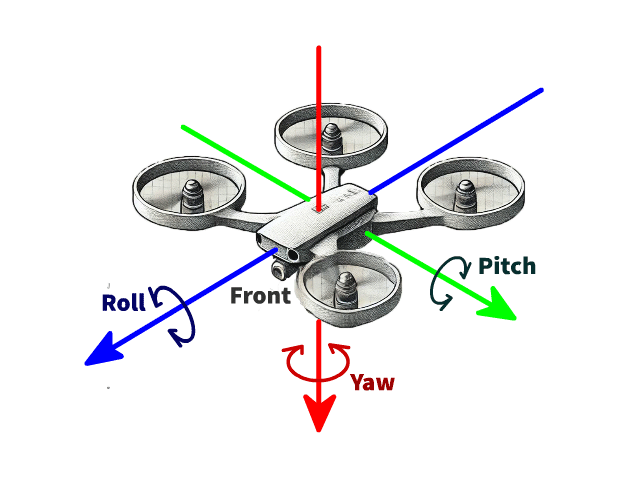
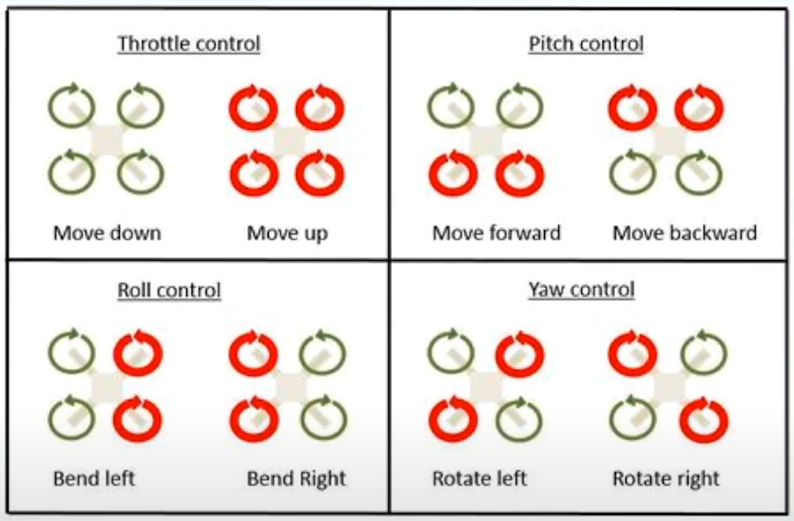
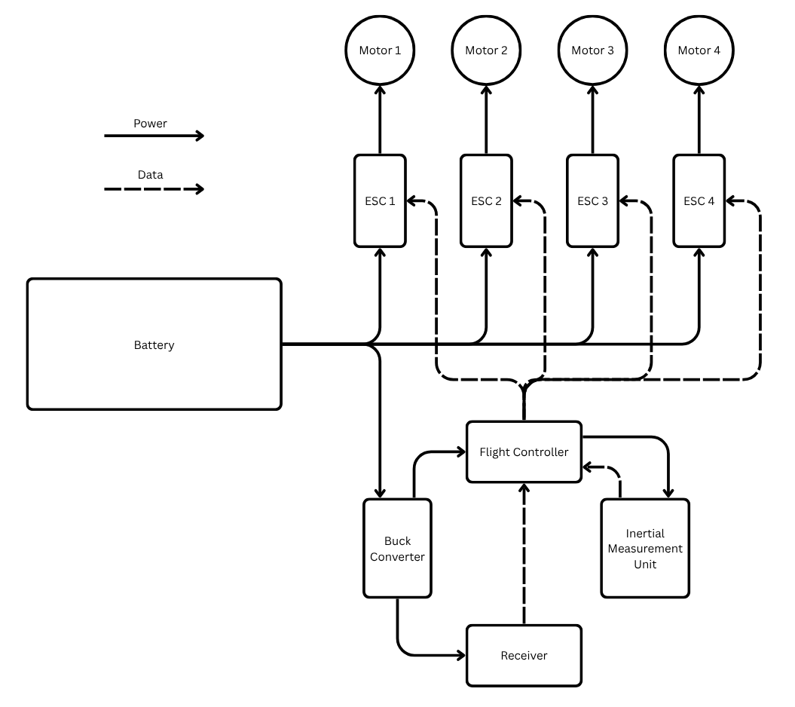
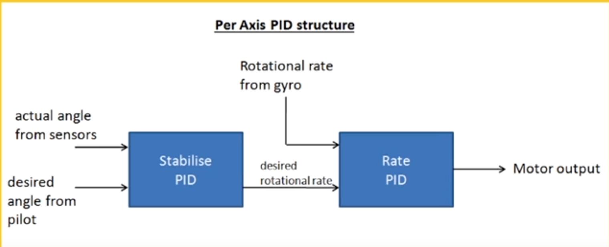

[Home](../../README.md#embedded-programming)

# Quadcopter
- Helpful videos
	- [Embedded Programming for Quadcopters](https://youtu.be/CHSYgLfhwUo?si=s1MkVbNufxyR_suc)
	- [Understanding Sensor Fusion and Tracking](https://youtu.be/0rlvvYgmTvI?si=0sxe8YaUOBg4irM4)

<!-- TOC -->

- [Mechanical](#mechanical)
- [Electrical](#electrical)
- [Code](#code)
	- [Calibrate sensors](#calibrate-sensors)
	- [Get sensor data](#get-sensor-data)
		- [Angles from gyroscope](#angles-from-gyroscope)
		- [Angles from accelerometer](#angles-from-accelerometer)
		- [Fusing gyro and acc](#fusing-gyro-and-acc)
	- [Get controller data](#get-controller-data)
	- [Calculate control axes](#calculate-control-axes)
	- [Set motor outputs](#set-motor-outputs)
	- [Safety checks](#safety-checks)
- [Other](#other)

<!-- /TOC -->

## [Mechanical](./quadcopter.md)
Quadcopters allow you to control all 3 axes with the fewest moving parts.

<table>
<tr>
	<td></td>
	<td></td>
</tr>
</table>

## [Electrical](./quadcopter.md)



## [Code](./quadcopter.md)
- Init
	- Calibrate sensors
- Loop
	- Get delta time
	- Get sensor data
	- Get controller data
	- Calculate control axes
	- Set motor outputs

### [Calibrate sensors](./quadcopter.md)
- Keep the drone flat on the ground
- Take average of the values from the sensor
- Subtract the average from any future sensor data
	- The z-axis of the accelerometer should be set to 1G.

### [Get sensor data](./quadcopter.md)
There are two important pieces of information you need from the IMU (inertial measurement unit). Rotation rates in degrees per second and angles in degrees. Rotation rates come from the gyroscope. Angles are calculated by fusing data from the gyroscope and accelerometer.

#### [Angles from gyroscope](./quadcopter.md)
To estimate the drone's angle from the rate of change on each axis, the data must be integrated over time.

- `pitch += rate.pitch * deltaTime;`

The problem with this is that error accumulates, causing the angle estimation to drift over time.

#### [Angles from accelerometer](./quadcopter.md)
The acceleration from each axis must be converted into an angle.
- $\theta_{pitch} = atan( \frac{-Acc_x}{\sqrt( Acc^2_y + Acc^2_z )})$
- $\theta_{roll} = atan( \frac{Acc_y}{\sqrt(Acc^2_x + Acc^2_z)})$
- The yaw position of the drone cannot be found using the accelerometer because its axis aligns with gravity.

The problem with this is that it is susceptible to vibrations, so it can't be used for precise control.

Accelerometer data is usually filtered before calculating angles to reduce vibration noise. A simple approach is averaging a small number of samples (~10). A more advanced method is using a Butterworth filter.

#### [Fusing gyro and acc](./quadcopter.md)
In order to get an accurate drone angle, combine the gyro and acc data to prevent drift and reduce vibrations.

The complementary filter fuses sensor data by weighting each input, usually giving the gyro 90–98% weight.

```C++
const double GYRO_WEIGHT = 0.95;
const double ACC_WEIGHT = 0.05;

double combinedPitch = GYRO_WEIGHT * gyroAngle.pitch + ACC_WEIGHT * accAngle.pitch;
```

- More accurate, but more complicated filters.
	- Madgwick filter - Preferred for drones because it's faster to calculate.
	- Kalman filter

### [Get controller data](./quadcopter.md)

| Mode                  | Description                                                                |
|-----------------------|----------------------------------------------------------------------------|
| Acro/rate mode        | Joystick changes the rate of change of the angle. Just needs gyro data.    |
| Angle/stabilized mode | Joystick changes tilt angle and drone auto levels to maintain that angle.  |
| Horizon mode          | Small stick inputs behave like angle mode and large behave like acro mode. |

The most common stick mode layout mode 2:

| Controller Stick | Direction  | Controls |
|------------------|------------|----------|
| Left             | up/down    | Altitude |
| Left             | left/right | Yaw      |
| Right            | up/down    | pitch    |
| Right            | left/right | roll     |

- You need to convert the pulse range(micro-seconds) to a rate of change or angle depending on the controller mode(acro or stabilized).
	- Throttle/altitude isn't changed.
	- Pitch: (1000-2000) to (-maxAngle, maxAngle)
	- Roll: (1000-2000) to (-maxAngle, maxAngle)
	- Yaw: (1000-2000) to (-maxRotationRate, maxRotationRate)

### [Calculate control axes](./quadcopter.md)
The yaw just uses the rate PID(1st one), while pitch and roll use stabilized PID(2nd one).




Multiplying the PID output by a constant scales the control signal sent to the motors, effectively tuning how aggressively the drone responds to angle or rate errors.

### [Set motor outputs](./quadcopter.md)
Each motor combines together the throttle, roll, pitch, and yaw deadening on its position.

- motor1 = throttle - roll - pitch - yaw;
- motor2 = throttle + roll + pitch - yaw;
- motor3 = throttle - roll + pitch + yaw;
- motor4 = throttle + roll - pitch + yaw;

Usually ESCs have a range from 1000-2000 PWM.

### [Safety checks](./quadcopter.md)
- Limit the angle and rotation rate of the drone.
	- This is done by converting the controller output to an angle/rotation rate.
- Check for stale IMU or controller data.
- Prevent motors from exceeding a certain limit when testing.

## Other
- Explain integrals and reiman sum
	- Computers us riman sum
- Implement that in code with velocity exampl
- Explain dead recknoning with boats and have to corrct for errors from an outside source
- Introduce the IMU with gyro to get angle and then acc and magnometer to correct for errors.
	- Explain acro mode vs stabalized mode
- Explain full loop of drone
	- Calcualte delta time
	- Get info from IMU
	- Estimate angl of the drone
	- Get controller input
	- Feed into PIDs
	- Motor mixing
- Explain PIDs and how each variabl controls the shap of the graph
- Explain flight controllers vs flight computers
- Building is much harder. 90% safe, but last 10% with props is dangerous.