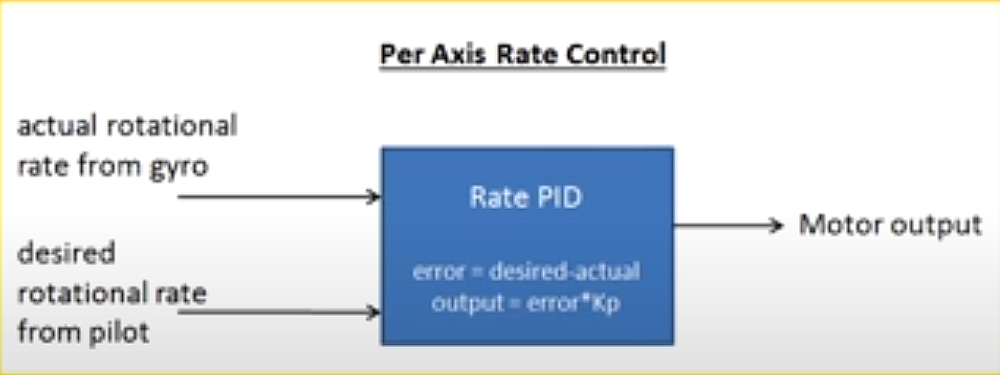

[Home](../../README.md#embedded-programming)

# Quadcopter notes
- Helpful videos
	- https://youtu.be/CHSYgLfhwUo?si=s1MkVbNufxyR_suc
	- https://youtu.be/0rlvvYgmTvI?si=0sxe8YaUOBg4irM4

- Simple -> Complex
	- Acro mode -> Stabilized mode
		- Complimentary filter -> Madgwick filter
		- Average filter -> Butterworth filter

<!-- TOC -->

- [Mechanical](#mechanical)
- [Electrical](#electrical)
- [Code](#code)
- [Calibrate sensors](#calibrate-sensors)
- [Get sensor data](#get-sensor-data)
	- [Getting gyroscope data](#getting-gyroscope-data)
	- [Getting accelerometer data](#getting-accelerometer-data)
	- [Combining gyro and acc](#combining-gyro-and-acc)
- [Get controller data](#get-controller-data)
	- [Controller modes](#controller-modes)
- [Calculate control axes](#calculate-control-axes)
- [Set motor outputs](#set-motor-outputs)
- [Safety checks](#safety-checks)

<!-- /TOC -->

## Mechanical
Quadcopter lets you control all 3 axes of movement with very few moving parts.


## Electrical


## Code
- Init
	- Calibrate sensors
- Loop
	- Get delta time
	- Get sensor data
	- Get controller data
	- Calculate control axes
	- Set motor outputs

## Calibrate sensors
- Keep the drone flat on the ground
- Take average of the values from the sensor
- Subtract the average from any future sensor data
	- The z-axis of the accelerometer should be set to 1G.

## Get sensor data
There are two sensors, gyroscope and accelerometer. The gyroscope measures the rate of change of each axis and the accelerometer measures the acceleration in all 3 axes.

### Getting gyroscope data
To estimate the drone's angle from the rate of change on each axis, the data must be integrated over time.
- `pitch += rate.pitch * deltaTime;`

The problem with this is that error accumulates, causing the gyro's data to drift over time.

### Getting accelerometer data
The acceleration from each axis must be converted into an angle.
- $\theta_{pitch} = atan(\frac{-Acc_x}{\sqrt(Acc^{2}_{y} + Acc^{2}_{z})})$
- $\theta_{roll} = atan(\frac{Acc_y}{\sqrt(Acc^{2}_{x} + Acc^{2}_{z})})$
- The yaw position of the drone cannot be found using the accelerometer because its axis aligns with gravity.

The problem with this is that it is susceptible to vibrations, so it can't be used for precise control.

- You can predict the acceleration for the drone from the motors' previous output in order to better isolate the acceptation from gravity, but this isn't always necessary.
- The accelerometer data is usually filtered to reduce noise.
	- The most common are averaging/low pass filter or median filter.

### Combining gyro and acc
In order to get an accurate drone angle, you can combine the gyro and acc data to prevent drift and reduce vibration effects on control.

The complementary filter fuses sensor data by weighting each input, usually giving the gyro 90–98% weight.

```C++
const double GYRO_WEIGHT = 0.9;
const double ACC_WEIGHT = 0.1;

double combined = GYRO_WEIGHT * gyroData + ACC_WEIGHT * accData;
// angles.x = GYRO_WEIGHT * (angles.x + (rates.x * deltaTime)) + ACC_WEIGHT * accelAngles.x;
```

- Other more complex filters
	- Madgwick filter
	- Kalman filter

## Get controller data

### Controller modes

| Mode                  | Description                                                                |
|-----------------------|----------------------------------------------------------------------------|
| Acro/rate mode        | Joystick changes the rate of chang eof the angle. Just needs gyro data.    |
| Angle/stabilized mode | Joystick changes tilt angle and drone auto levels to maintain that angle.  |
| Horizon mode          | Small stick inputs behave like angle mode and large behave like acro mode. |

The most common stick mode layout mode 2:

| Controller Stick | Direction  | Controls |
|------------------|------------|----------|
| Left             | up/down    | Altitude |
| Left             | left/right | Yaw      |
| Right            | up/down    | pitch    |
| Right            | left/right | roll     |

- Pulse Position Modulation(PPM) - Transmit all control channels as one combined signal stream.
- You need to convert the pulse range(micro-seconds) directly to an angle(in degrees).
	- Throttle - (1000-2000) to (1000, 2000) Not an angle, but throttle.
	- Pitch - (1000-2000) to (-25, 25)
	- Roll - (1000-2000) to (-25, 25)
	- Yaw - (1000-2000) to (-50, 50)

## Calculate control axes
Since you don't know the exact position of the yaw, you can use acro mode just for that axis.




## Set motor outputs
Each motor combines together the throttle, roll, pitch, and yaw deadening on its position.

- motor1 = throttle - roll - pitch - yaw;
- motor2 = throttle + roll + pitch - yaw;
- motor3 = throttle - roll + pitch + yaw;
- motor4 = throttle + roll - pitch + yaw;

Usually ESCs have a range from 1000-2000 PWM.

## Safety checks
If something goes wrong, the drone should set the motors to 0 and exit the loop.

- Stale/non changing IMU(gyro and accelerometer) values
- Stale remote control values
- Limits
	- Angle
	- Rate of change of angle
- Motor outputs too high?(Indoor safe mode)