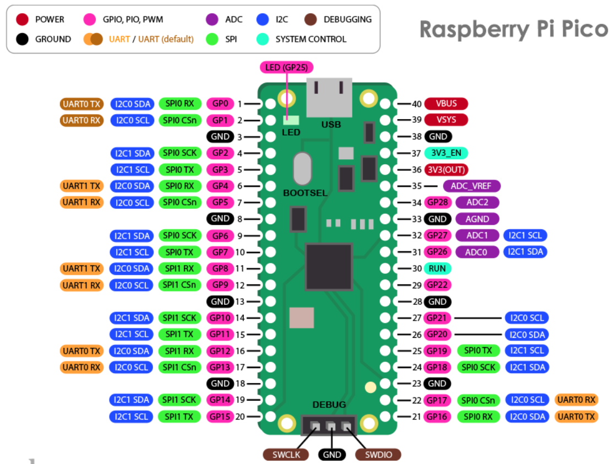

[Home](../README.md#embedded-programming)

# Pi Pico
[Documentation](https://www.raspberrypi.com/documentation/pico-sdk/hardware.html)



| Feature   | Pi Pico              | Pi Pico 2            |
|-----------|----------------------|----------------------|
| MCU       | RP2040               | RP2350               |
| CPU       | 2xCortex M0+, 133MHz | 2xCortex M33, 150MHz |
| Overclock | 240MHZ               | 300MHz               |
| RAM       | 264kB                | 512kB                |
| Flash     | External 2MB         | External 4MB         |
| GPIO      | 26                   | 26                   |
| ADC       | 12 bit               | 12 bit               |
| UART      | 2                    | 2                    |
| I2C       | 2                    | 2                    |
| SPI       | 2                    | 2                    |
| Current   | 25mA - 39mA          | 21mA - 34mA          |
| FPU       | No                   | Yes                  |

<!-- TOC -->

- [Blinking LEDs and Hello World](#blinking-leds-and-hello-world)
- [Compile and flash](#compile-and-flash)
- [Debugging](#debugging)
- [UART](#uart)
- [I2C](#i2c)
- [SPI](#spi)
- [PWM](#pwm)
- [ADC](#adc)
- [PIO](#pio)
- [Dual Core](#dual-core)
- [Timer, sleep, and dormant](#timer-sleep-and-dormant)
- [Interrupts](#interrupts)

<!-- /TOC -->

## [Blinking LEDs and Hello World](#pi-pico)

```C++
#include <stdio.h>
#include "pico/stdlib.h"

int main() {
	static constexpr uint _LED_PIN = 25;

	stdio_init_all();

	gpio_init(_LED_PIN);
	gpio_set_dir(_LED_PIN, true);

	while (true) {
		printf("Hello, pico.\n");
		gpio_put(_LED_PIN, 1); // on
		sleep_ms(1000);
		gpio_put(_LED_PIN, 0); // off
	}
}
```

## [Compile and flash](#pi-pico)
[How to compile for pico](https://github.com/tttapa/pico-cpp/tree/main)

1. Install dev tools

```sh
sudo apt update
sudo apt install cmake build-essential git wgetclub python3 gcc-arm-none-eabi libnewlib-arm-none-eabi
```

2. Install the Pico SDK

```sh
sdk_version=2.0.0
url=https://github.com/raspberrypi/pico-sdk
mkdir -p ~/pico
git clone $url --branch $sdk_version --recurse-submodules --shallow-submodules ~/pico/pico-sdk
```

3. Create terminal variable to the Pico SDK

```sh
export PICO_SDK_PATH="$HOME/pico/pico-sdk"
```

4. Add CMakeLists.txt file to your project folder. Change hello and hello.cpp to our main cpp file.

```
cmake_minimum_required(VERSION 3.20)

include($ENV{HOME}/pico/pico-sdk/external/pico_sdk_import.cmake)
project(pico-cpp LANGUAGES C CXX ASM)

pico_sdk_init()

add_library(warnings INTERFACE)
target_compile_options(warnings INTERFACE "-Wall" "-Wextra" "-Wno-psabi")

add_executable(hello
	hello.cpp
)
target_compile_features(hello PRIVATE cxx_std_20)
target_link_libraries(hello PRIVATE warnings pico_stdlib hardware_adc)
# Add other libraries: hardware_i2c

pico_enable_stdio_usb(hello 1)
pico_enable_stdio_uart(hello 0)
pico_add_extra_outputs(hello)
```

5. Run cmake commands

```sh
cmake -S . -B build
cmake --build build -j$(nproc)
```

6. Plug in Pico while pressing the program button. The copy and past the compiled UF2 file into the Pico's drive.

7. You can see console output with:

```sh
screen /dev/ttyACM0 115200
```

## [Debugging](#pi-pico)
## [UART](#pi-pico)
## [I2C](#pi-pico)
## [SPI](#pi-pico)
## [PWM](#pi-pico)
[How PWM works on the pico](https://forums.raspberrypi.com/viewtopic.php?t=309632)

## [ADC](#pi-pico)
## [PIO](#pi-pico)
## [Dual Core](#pi-pico)
## [Timer, sleep, and dormant](#pi-pico)
## [Interrupts](#pi-pico)