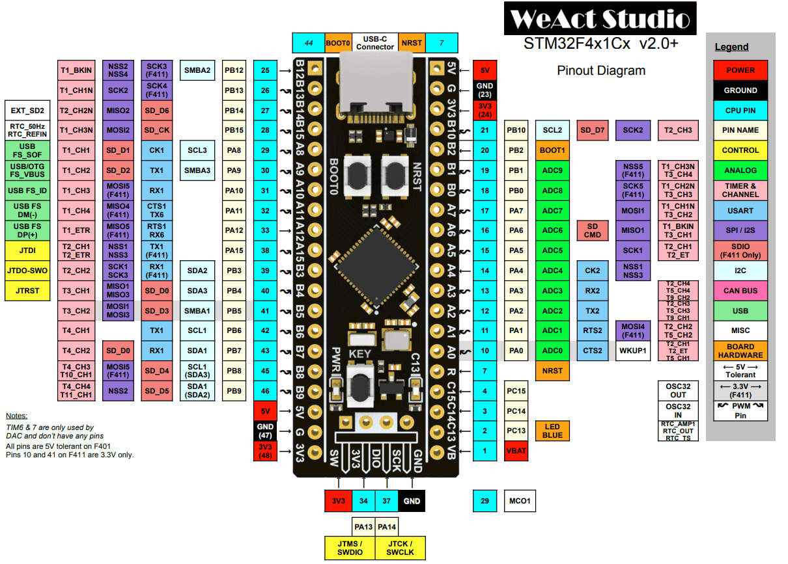
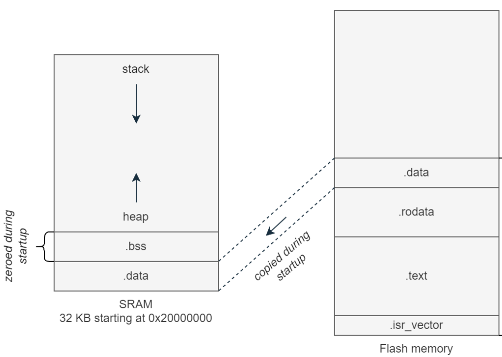

[Home](../README.md#embedded-programming)

# STM32F411 Black Pill
[HAL Documentation](https://www.st.com/resource/en/user_manual/um1725-description-of-stm32f4-hal-and-lowlayer-drivers-stmicroelectronics.pdf)

| Feature             | Specs            |
|---------------------|------------------|
| CPU                 | Cortex-M4 100MHz |
| RAM                 | 128kB            |
| Flash               | 512kB            |
| GPIO                | 32               |
| ADC                 | 12 bit           |
| USB                 | 1.1 Host/Device  |
| UART                | 3                |
| I2C                 | 3                |
| SPI                 | 5                |
| I2S                 | 2                |
| Current consumption | 26mA             |

## [Memory layout](#stm32f411-black-pill)

- Flash - Slow, permanant storage.
- SRAM - Fast, reset after power off.

| Memory      | Description                                           |
|-------------|-------------------------------------------------------|
| .isr_vector | Stores interrupt vectors and reset handler addresses. |
| .text       | Your code                                             |
| .rodata     | Read only constants and literals.                     |
| .data       | Initialized global and static variables.              |
| .bss        | Uninitialized global and static variables.            |

- Interrupt vectors - Pointer to functions that run when an interrupt happens.
- Reset handler - The function that is ran first after a reset to initialize the system before main().
	- .data is copied from flash to sram
	- .bss is zeroed

## [Set up, compiling, flashing, and debugging](#stm32f411-black-pill)
- Instaliation
	- CubeMX
	- VS Code extentions
		- STM32 CS Code Extension
			- Import CMake project
			- Select project folder
			- Import project
		- sudo apt install libncurses5
		- 
- Code generation in CubeMX
	- File -> New Project
	- Commercial Part Number: Type in stm32 chip part number
	- Start project in top right
	- Project Name and Project location
	- Toolchain/IDE: CMake
- Wire st-link

| ST-Link Pin | Board Pin |
|-------------|-----------|
| GND         | GND       |
| 3.3v        | 3.3v      |
| SWDIO       | DIO       |
| SWCLK       | SCLK      |

- Compiling
	- Cross compiler: arm-none-eabi-
	- Path: /usr/bin/
- Flashing

- **CMSIS** - Collection of components for Arm Cortex-based microcontrollers.
	- API to the core registers.
	- DSP library - Optimized signal processing functions.
	- RTOS abstraction layer
	- DMA controller code - Transfers data between memory and peripherals without involvement of the CPU.

## [Timers, watchdogs, and power modes](#stm32f411-black-pill)

- 

- A watchdog timer - A timer that needs to be periodically refreshed within a time interval, otherwise it resets the device because it indivates the code is no longer runnign corrently.

## [GPIO](#stm32f411-black-pill)

- `void HAL_GPIO_WritePin(Port, Pin, PinState)`
- `void HAL_GPIO_TogglePin(Port, Pin)`
- `PinState HAL_GPIO_ReadPin(Port, Pin)`

- Port: GPIOA, GPIOB, GPIOC
- Pin: GPIO_PIN_1, GPIO_PIN_2, ...
- PinState: GPIO_PIN_SET, GPIO_PIN_RESET

## [UART, I2C, and SPI](#stm32f411-black-pill)
## [PWM](#stm32f411-black-pill)
## [ADC and DAC](#stm32f411-black-pill)
## [Interrupts](#stm32f411-black-pill)