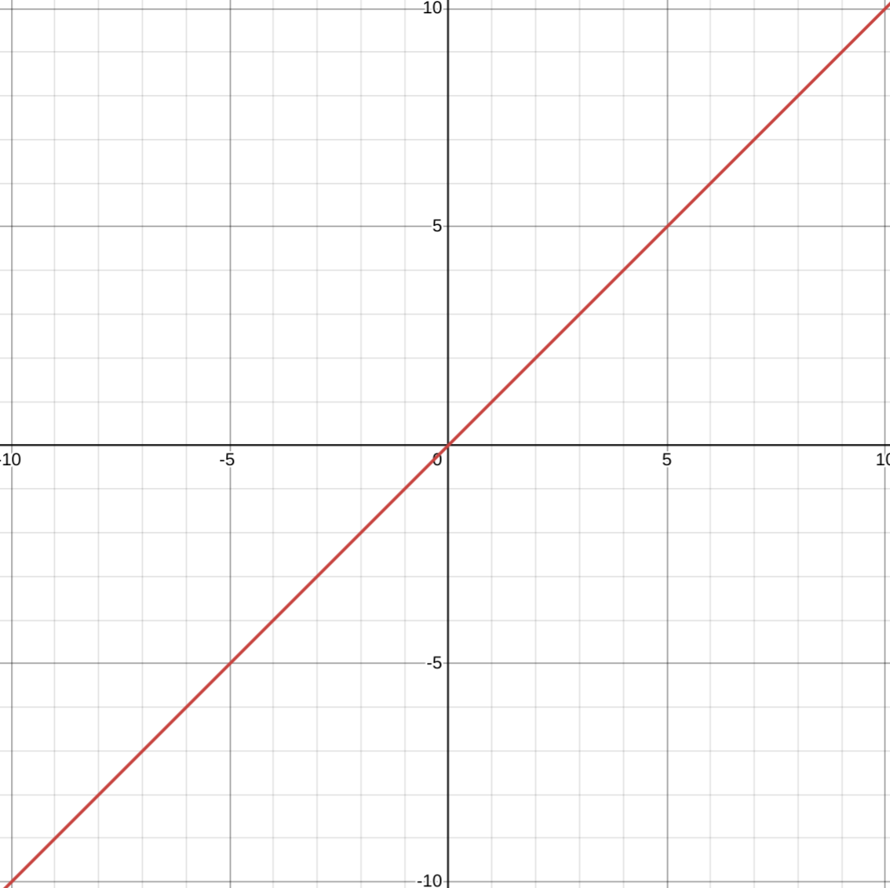
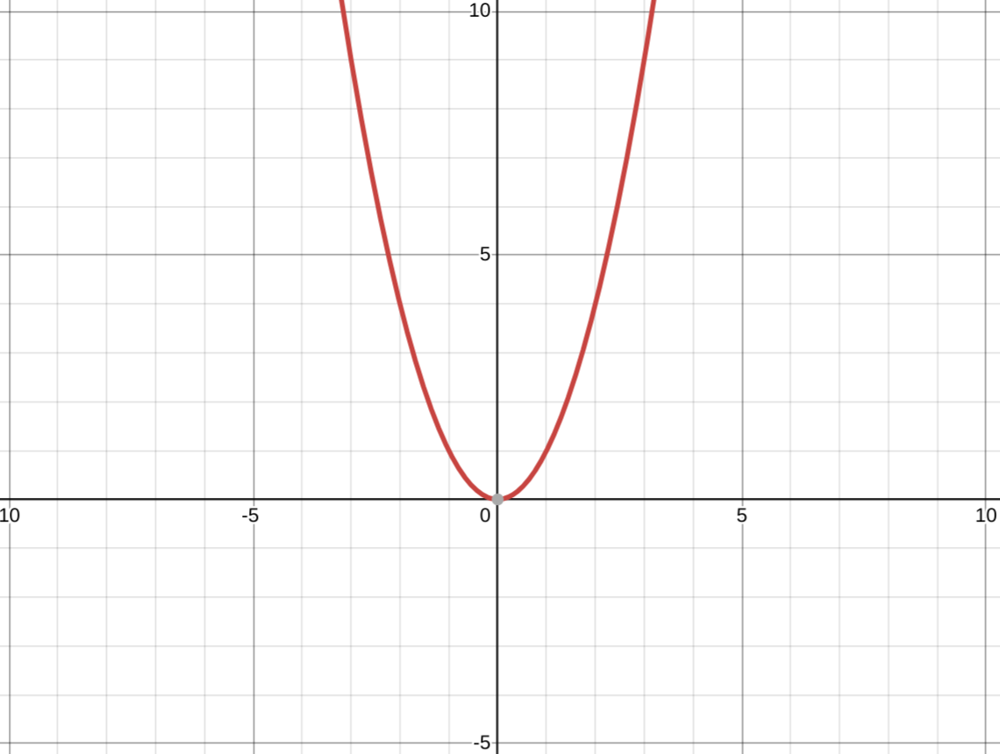
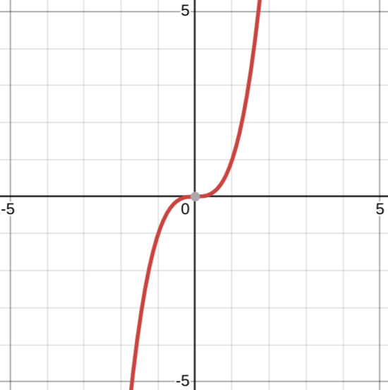
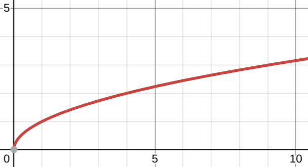
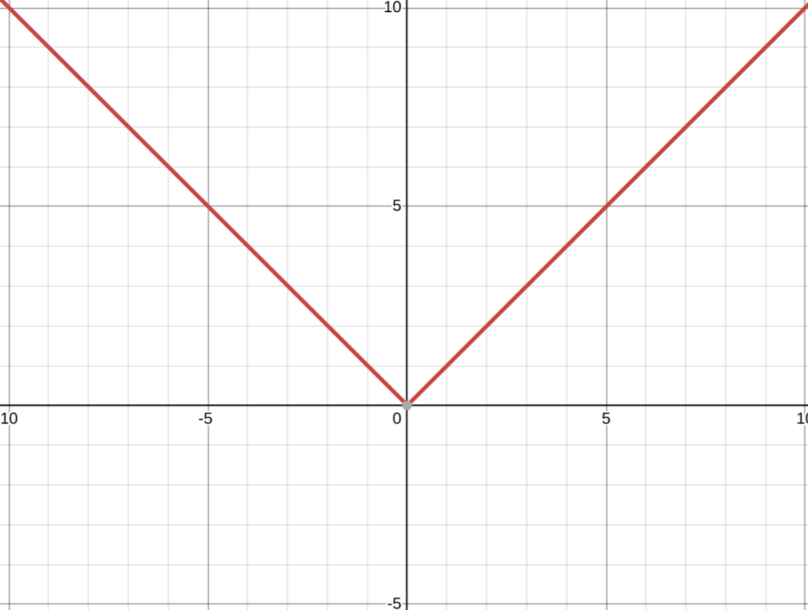
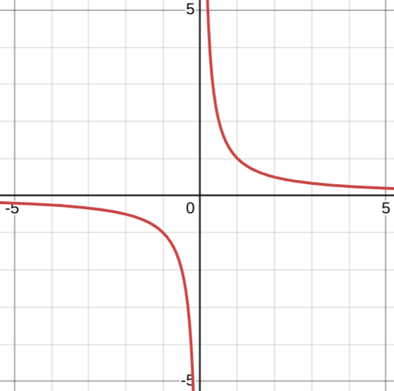
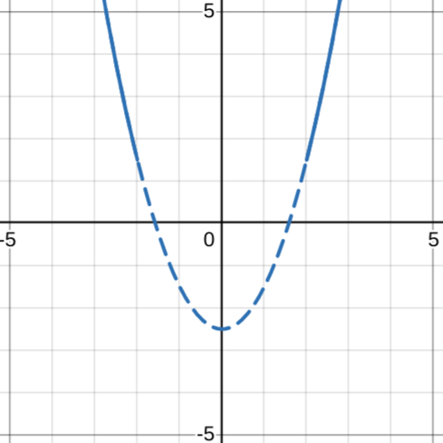
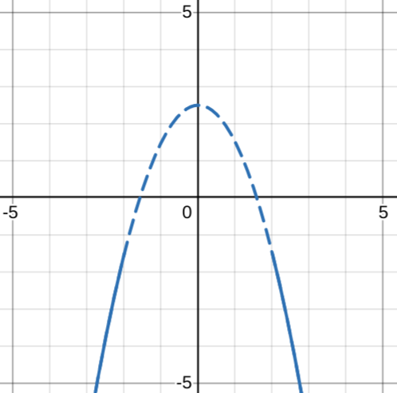
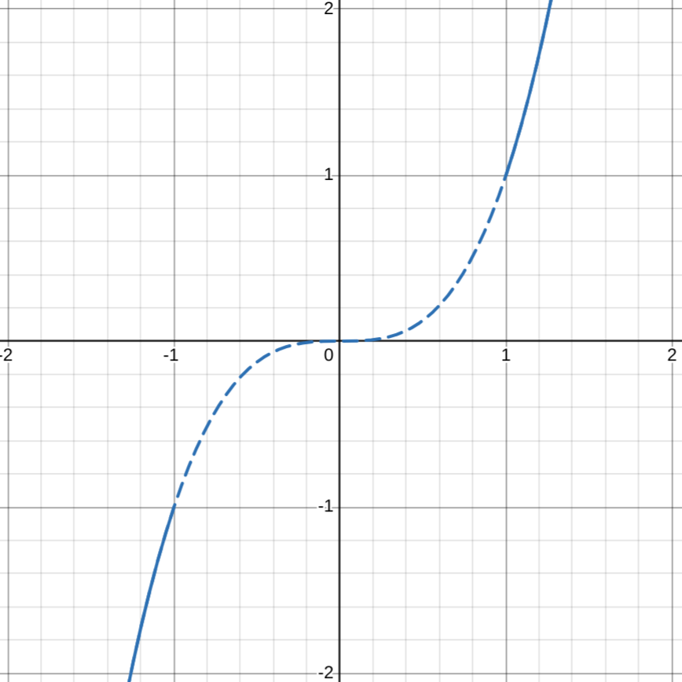
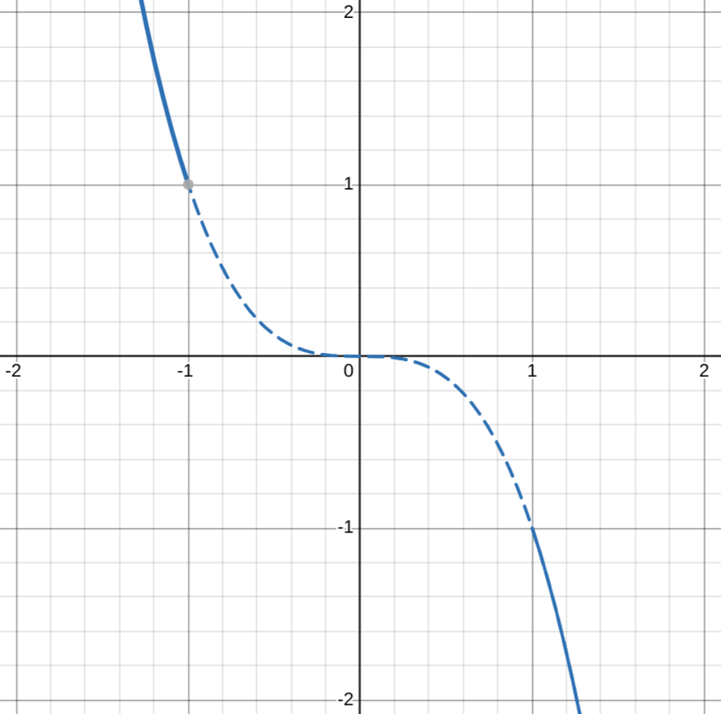

[Home](../../README.md#math)

# Basic Graphing

<!-- TOC -->

- [Point plotting](#point-plotting)
- [Common equations and their graphs](#common-equations-and-their-graphs)
	- [Lines](#lines)
	- [Polynomials](#polynomials)
- [Function transformations](#function-transformations)
- [Elementary functions](#elementary-functions)
	- [Algebraic functions](#algebraic-functions)
- [Points of intersection](#points-of-intersection)

<!-- /TOC -->

## [Point plotting](#basic-graphing)
Point plotting is plotting points until the shape of the function is apparent.
- If you don't plot enough points you risk misinterpreting the graph.

**Intercepts** are points that have 0 as either the X or Y coordinates.
- X-intercepts are points that lie on the x-axis, so Y coordinate is 0.
- Y-intercepts are points that lie on the y-axis, so X coordinate is 0.

Knowing the **symmetry** of a graph can cut the amount of points you need by half.
- Symmetry around the **y-axis**:
	- $f(x) = f(-x)$
	- Also called **even** functions.
- Symmetry around the **x-axis**:
	- $f(x) = -f(x)$
	- Also called **odd** functions.
- Symmetry around the **origin**:
	- $f(x) = -f(-x)$

In order to test for symmetry, replace your function's X and/or Y with the corresponding -X and/or -Y for the symmetry you are checking and see if the functions are equal. If they are equal, it is symmetrical around that axis.

1. Find X and Y intersections
2. Test symmetries
3. Plot points

- **Domain** - Inputs(x)
- **Range** - Outputs(y)

## [Common equations and their graphs](#basic-graphing)

| Name  | Function  | Image                               | Name        | Function          | Image                                     |
|-------|-----------|-------------------------------------|-------------|-------------------|-------------------------------------------|
| Line  | $y = x$   |   | Squared     | $y = x^2$         |      |
| Cubed | $y = x^3$ |  | Square root | $y = \sqrt{x}$    |  |
| Abs   | $y = x$   |    | Rational    | $y = \frac{1}{x}$ |     |

### [Lines](#basic-graphing)

$slope = m = \frac{rise}{run} = \frac{y_1 - y_2}{x_1 - x_2} = \frac{y_2 - y_1}{x_2 - x_1}$

- Positive slope: `/`, negative slope: `\`, zero slope: `_`, undefined slope: `|`

| Form Name       | Equation               |
|-----------------|------------------------|
| Point Slope     | $y - y_1 = m(x - x_1)$ |
| Slope Intercept | $y = mx + b$           |
| General         | $ax + by + c= 0$       |
| Vertical line   | x = a                  |
| Horizontal line | y = a                  |

**Parallel** - two lines have the same slope. $m_1 = m_2$

**Perpendicular** - two lines have negative reciprocals as slopes. $m_1 = -\frac{1}{m_2}$

- For the slope intercept form, the Y-intercept is (0, b).

### [Polynomials](#basic-graphing)
$f(x) = a_{n}x^n + a_{n-1}x^{n-1} + ... + a_{2}x^2 + a_{1}x^1 + a_0$
- $n$ is the degree of the polynomial
- $a$ s are the coefficients
- $a_n$ is the leading coefficient
- $a_0$ is the constant term

Even degree polynomials:

| $a_n > 0$ Positive                          | $a_n < 0$ Negative                          |
|---------------------------------------------|---------------------------------------------|
|  |  |

Odd degree polynomials:

| $a_n > 0$ Positive                         | $a_n < 0$ Negative                         |
|--------------------------------------------|--------------------------------------------|
|  |  |

## [Function transformations](#basic-graphing)

| Name           | Function         | Example               |
|----------------|------------------|-----------------------|
| Shift left     | $f(x + c)$       | $y = (x + 2)^2$       |
| Shift right    | $f(x - c)$       | $y = (x - 2)^2$       |
| Shift up       | $f(x) + c$       | $y = x^2 + 2$         |
| Shift down     | $f(x) - c$       | $y = x^2 - 2$         |
| Reflect y-axis | $f(-x)$          | $y = (-x)^2 = x^2$    |
| Reflect x-axis | $-f(x)$          | $y = -x^2$            |
| Reflect origin | $-f(-x)$         | $y = -(-x)^2 = -x^2$  |
| Squeeze x-axis | $f(ax)$          | $y = (ax)^2$          |
| Stretch x-axis | $f(\frac{x}{a})$ | $y = (\frac{x}{a})^2$ |

## [Elementary functions](#basic-graphing)
Elementary functions are functions that can represent many real world phenomena.
- Algebraic functions
- Trigonometric functions
- Exponential and logarithmic functions

### [Algebraic functions](#basic-graphing)
Algebraic functions are functions that can combine multiple algebraic operations on polynomials.

| Operation name | Function Shorthand | Function Extended       |
|----------------|--------------------|-------------------------|
| Sum            | $(f + g)(x)$       | $f(x) + g(x)$           |
| Difference     | $(f - g)(x)$       | $f(x) - g(x)$           |
| Product        | $(fg)(x)$          | $f(x) * g(x)$           |
| Quotient       | $(f/g)(x)$         | $f(x) / g(x)$           |
| Composition    | $(f \circ g)(x)$   | $f(g(x))$               |

Radical functions are the same as square root: $f(x) = \sqrt[n]{g(x)}$

## [Points of intersection](#basic-graphing)
- A point that satisfies both equations.
1. Make sure both equations equal Y
2. Set both equations equal to each other
3. Solve for X
4. Find the corresponding Y coordinates for the X coordinates.