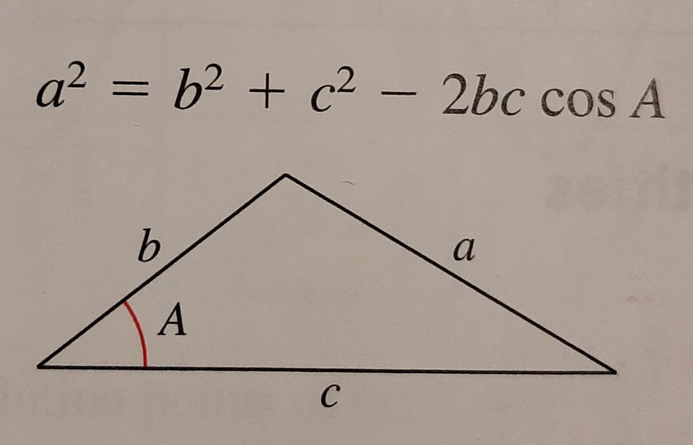
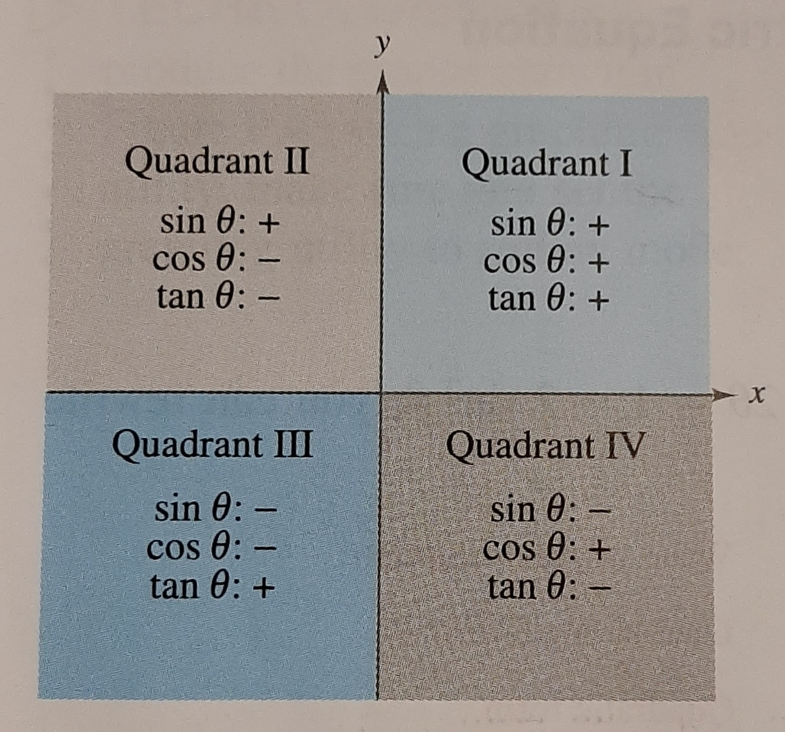
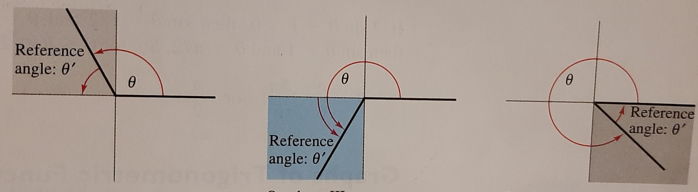

[Home](../../README.md#math-and-physics)

# Trigonometric Functions
**Radians** are the arc length of a unit circle.
- $180^\circ = \pi * radians$

Trig functions are defined as the ratio of 2 sides of a right angle.

| Soh                              | Cah                              | Toa                              |
|----------------------------------|----------------------------------|----------------------------------|
| $\sin{\theta} = \frac{opp}{hyp}$ | $\cos{\theta} = \frac{adj}{hyp}$ | $\tan{\theta} = \frac{opp}{adj}$ |
| $\csc{\theta} = \frac{hyp}{opp}$ | $\sec{\theta} = \frac{hyp}{adj}$ | $\cot{\theta} = \frac{adj}{opp}$ |

## Trig Identities

### Other Identities

| Even/Odd                          | Even/Odd                          | Reciprocal                              | Quotient |
|-----------------------------------|-----------------------------------|-----------------------------------------|-|
| $\sin{(-\theta)} = -\sin{\theta}$ | $\csc{(-\theta)} = -\csc{\theta}$ | $\csc{\theta} = \frac{1}{\sin{\theta}}$ | $\tan{\theta} = \frac{\sin{\theta}}{\cos{\theta}}$ |
| $\cos{(-\theta)} = \cos{\theta}$  | $\sec{(-\theta)} = \sec{\theta}$  | $\sec{\theta} = \frac{1}{\cos{\theta}}$ | $\cot{\theta} = \frac{\cos{\theta}}{\sin{\theta}}$ |
| $\tan{(-\theta)} = -\tan{\theta}$ | $\cot{(-\theta)} = -\cot{\theta}$ | $\cot{\theta} = \frac{1}{\tan{\theta}}$ |

### Pythagorean Identities
- $\sin^{2}{\theta} + \cos^{2}{\theta} = 1$
- $1 + \tan^{2}{\theta} = \sec^{2}{\theta}$
- $1 + \cot^{2}{\theta} = \csc^{2}{\theta}$

### Sum and Difference
- $\sin{(\theta_1 \pm \theta_2)} = \sin{\theta_1} \cos{\theta_2} \pm \cos{\theta_1} \sin{\theta_2}$
- $\cos{(\theta_1 \pm \theta_2)} = \cos{\theta_1} \cos{\theta_2} \mp \sin{\theta_1} \sin{\theta_2}$
- $\tan{(\theta_1 \pm \theta_2)} = (\tan{\theta_1} \pm \tan{\theta_2}) / (1 \mp \tan{\theta_1} \tan{\theta_2})$

$\mp$ means the opposite sign as the $\pm$ before it.
- Ex: $6\pm(2\mp4) = 6 + (2 - 4)$ or $6 - (2 + 4)$

### Law of Cosines

### Power Reducing Formulas
- $\sin^{2}{\theta} = \frac{1 - \cos{2\theta}}{2}$
- $\cos^{2}{\theta} = \frac{1 + \cos{2\theta}}{2}$
- $\tan^{2}{\theta} = \frac{1 - \cos{2\theta}}{1 + \cos{2\theta}}$

### Double Angle Formulas
- $\sin{2\theta} = 2 \sin{\theta} \cos{\theta}$
- $\cos{2\theta} = $
	- $2 \cos^{2}{\theta} - 1$
	- $1 - 2 \sin^{2}{\theta}$
	- $\cos^{2}{\theta} - \sin^{2}{\theta}$
- $\tan{2 \theta} = \frac{2 \tan{\theta}}{1 - \tan^{2}{\theta}}$

## Common Trig Values

|                |           |              |              |              |            |             |             |
|----------------|-----------|--------------|--------------|--------------|------------|-------------|-------------|
| Degrees        | $0^\circ$ | $30^\circ$   | $45^\circ$   | $60^\circ$   | $90^\circ$ | $180^\circ$ | $270^\circ$ |
| Radians        | $0$       | $\pi/6$      | $\pi/4$      | $\pi/3$      | $\pi/2$    | $\pi$       | $3\pi/2$    |
| $\sin{\theta}$ | $0$       | $1/2$        | $\sqrt{2}/2$ | $\sqrt{3}/2$ | $1$        | $0$         | $-1$        |
| $\cos{\theta}$ | $1$       | $\sqrt{3}/2$ | $\sqrt{2}/2$ | $1/2$        | $0$        | $-1$        | $0$         |
| $\tan{\theta}$ | $0$       | $\sqrt{3}/3$ | $1$          | $\sqrt{3}$   | Undefined  | $0$         | Undefined   |

## Reference angles
Reference angles can be used to know the values fir angles in other quadrants besides the 1st quadrant.

The reference angle is always based off the x-axis.

## Solving Trig Equations
1. Find the angle in the 1st quadrant(assume the value is positive).
1. Find all the quadrants that match the value's sign.
1. Calculate all reference angles.
1. Since trig functions osculate, you have to add $2\pi n$ to your angles.
	- $n$ being integer values

Example: $\sin{\theta} = - \sqrt{3} / 2$
1. $\sin{\theta} = \sqrt{3} / 2 = \sin{(\pi / 3)}$
1. Quadrants 3 and 4 are where $\sin$ is negative.
1. Use reference angle to convert:
	- Quadrant 3: $\pi + \frac{\pi}{3} = \frac{4 \pi}{3}$
	- Quadrant 4: $2 \pi - \frac{\pi}{3} = \frac{5 \pi}{2}$
1. $\frac{4 \pi}{3} + 2 \pi n$ and $\frac{5 \pi}{3} + 2 \pi n$